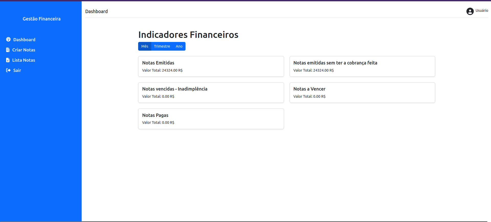

## 
<div style="display: flex; align-items: center;">
  <span style="margin-left: 10px; font-size: 24px; font-weight: bold;">Sistema de Gestão Financeira</span>
</div>
<hr>

Esta aplicação consiste em um sistema de Gestão Financeira, onde as empresas podem gerenciar suas notas fiscais. Essa ferramenta pode ser utilizada pelo pessoal responsável pelo financeiro para manter o controle das notas e conhecer os principais indicadores.



## Arquitetura da Aplicação:

A arquitetura da aplicação é cliente-servidor, onde o cliente é o front-end da aplicação e o servidor é o back-end, com o banco de dados para persistência dos dados.

## Tecnologias Utilizadas no Projeto:

### Front-end:

- React.js
- HTML
- CSS
- Bootstrap

### Back-end:

- Express.js
- Prisma

### Banco de Dados:

- MySQL

## Rodando o Projeto:

### Dependências:

- É necessário ter o Docker e o Docker Compose instalados no seu computador para rodar o banco de dados do projeto. Para instalar, acesse: [Instalar Docker](https://docs.docker.com/engine/install/) e [Instalar Docker Compose](https://docs.docker.com/compose/install/).

- É necessário ter o Node.js instalado no seu computador. Para instalar, acesse: [Instalar Node.js](https://nodejs.org/en/download/package-manager).

### Executando o Projeto:

1. Abra um terminal na pasta raiz do projeto e execute o seguinte comando para instanciar o banco de dados:

    ```bash
    docker-compose up
    ```

2. Acesse a pasta back-end em um novo terminal e execute o seguinte comando para iniciar o back-end da aplicação:

    ```bash
    ./run.sh
    ```

3. Acesse a pasta front-end em um novo terminal e execute os seguintes comandos para iniciar o front-end da aplicação:

    ```bash
    npm install
    npm start
    ```

Se tudo ocorrer bem, você deve ser capaz de acessar a aplicação no seu navegador através da rota:

    http://localhost:3000/
